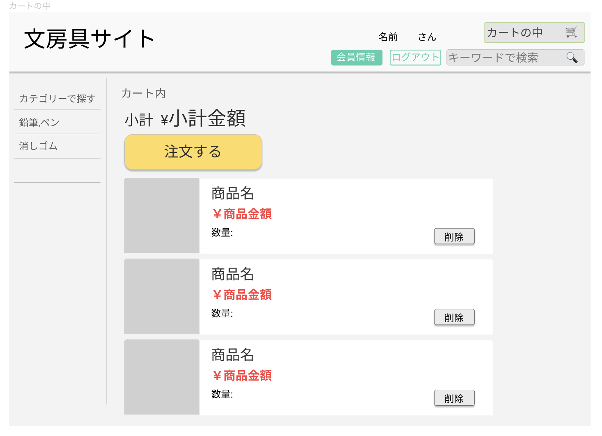

### 画面詳細
## カートの中
### プロトタイプは以下のリンク先
[プロトタイプ](https://www.figma.com/file/ZBReba9UB4XT2DDuA352MB/文房具サイト?node-id=0%3A1)

*****

*****

補足:対応DBの列はDB設計後、oを対応するテーブル・カラム名に差し替えること。
|ID|要素|内容|アクション|イベント|対応DB|
|--|---|----|---------|-------|------|
||バナー|サイト名表示|-  |-   |-     |
||ログイン|テキスト画像|- |-  |-     |
||会員情報|ボタン|クリック|ログイン処理実行||
||商品検索|テキスト画像|-    |-     ||
||商品名|テキスト名|-    |-       ||
||商品名|入力欄|テキスト入力|-   |〇|
||カテゴリテキスト表示|-    |-     ||
||検索|ボタン|クリック|検索処理実行|〇|
||商品一覧|画像ボタン|クリック|商品一覧に遷移|〇|
||カートの中|画像ボタン|クリック|カートの中に遷移|〇|
||登録情報|画像ボタン|クリック|登録情報に遷移|〇|
||商品|商品一覧|テキスト表示|-     |-     |〇|
||商品画像|画像リンク|クリック|商品詳細に遷移|〇|
||商品名|テキストリンク|クリック|商品詳細に遷移|〇|
||価格|テキスト表示|-    |-     |〇|
||削除|削除ボタン|クリック|-   ||

