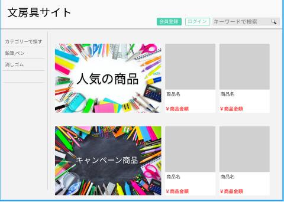

### 画面詳細図
## トップページ
### プロトタイプは以下のリンク先
[プロトタイプ](https://www.figma.com/file/ZBReba9UB4XT2DDuA352MB/文房具サイト?node-id=0%3A1)
*****

*****
捕捉：対応DBの列はDB設計後、○を対応するテーブル・カラム名に差し替えること。
| ID | 要素 | 内容 | アクション | イベント | 対応DB |
|----|------|-----|----------|---------|-------|
|1   |バナー|サイト名表示|-     |-        |-      |
|2   |カートの中|ボタン|クリック|カートに遷移|-|
|3   |会員登録|ボタン|クリック|会員登録へ遷移|-|
|4   |ログイン|ボタン|クリック   |ログイン画面へ遷移|-      |
|5   |キーワード検索|入力欄|テキスト入力|-|-|
|6   |検索ボタン|ボタン|クリック|検索処理実行|〇|
|7   |カテゴリ|テキスト表示|-       |-       ||
|8   |人気商品|画像|-|-|〇|
|9   |キャンペーン商品|画像|-|-|〇|
|10   |商品一覧|テキスト表示|-|-|〇|
|11   |商品画像|商品リンク|クリック |商品詳細へ遷移|〇|
|12   |商品名|テキストリンク|クリック|商品詳細へ遷移   |〇      |
|13   |価格|テキスト表示|-|-           |〇|

