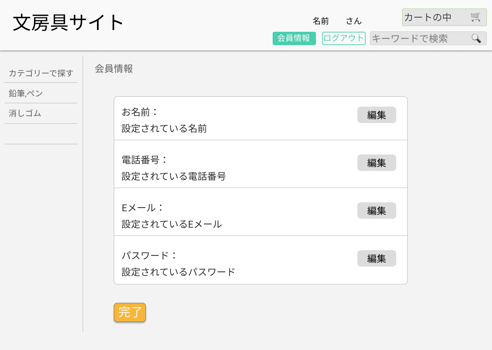

### 画面詳細図
## 会員情報
### プロトタイプは以下のリンク先
[プロトタイプ](https://www.figma.com/file/ZBReba9UB4XT2DDuA352MB/文房具サイト?node-id=0%3A1)

*****

*****

補足:対応DBの列はDB設計後、oを対応するテーブル・カラム名に差し替えること。
| ID | 要素 | 内容 | アクション | イベント | 対応DB |
|----|------|------|------------|----------|--------|
|||||||

