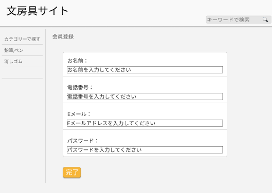

### 画面詳細図
## 会員登録
### プロトタイプは以下のリンク先
[プロトタイプ](https://www.figma.com/file/ZBReba9UB4XT2DDuA352MB/文房具サイト?node-id=0%3A1)

*****

*****

補足:対応DBの列はDB設計後、oを対応するテーブル・カラム名に差し替えること。
|ID|要素|内容|アクション|イベント|対応DB|
|--|---|----|---------|-------|------|
|1  |バナー|サイト名表示|-  |-   |-     |
|2  |会員登録|テキスト画像|- |-  |-     |
|3  |お名前|入力欄|テキスト入力|-  |〇|
|4  |電話番号|入力欄|テキスト入力|-  |〇|
|5  |Eメール|入力欄|テキスト入力|-  |〇|
|6  |PASS|入力欄|テキスト入力|-  |〇|
|5|完了ボタン|ボタン|クリック|会員情報へ遷移|-|
