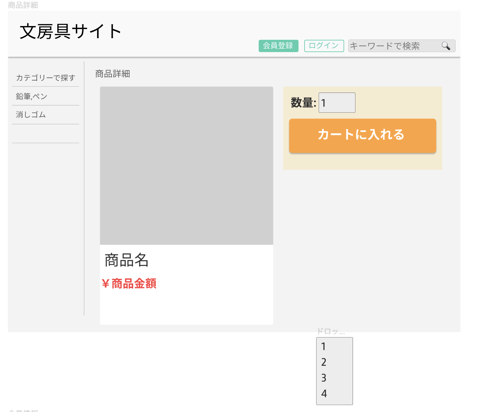

### 画面詳細

## 商品詳細ページ

### プロトタイプは以下のリンク先

[プロトタイプ]（https://www.figma.com/file/ZBReba9UB4XT2DDuA352MB/文房具サイト?node-id=0%3A1）
*****

*****

補足：対応DBの列はDB設計後、○を対応するテーブル・カラム名に差し替えること

| ID | 検索 | 内容 | アクション | イベント | 対応DB |
|----|-----|------|---------|-------|-------|
|1|バナー　|サイト名表示||||
|2|カテゴリ|テキスト表示||||
|3|鉛筆、ペン|ボタン||||
|4|消しゴム|ボタン||||
|5|会員情報|ボタン||||
|6|ログイン|ボタン||||
|7|キーワード検索|ボタン||||
|8|キーワード検索|入力値|テキスト入力|||
|9|商品画像|画像||||
|10|商品名|テキスト表示||||
|11|金額|テキスト表示||||
|12|数量|ラジオボタン||||
|13|カートに入れる|ボタン|カートに追加|||
