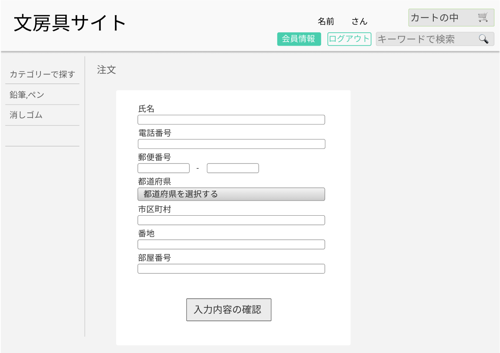

### 画面詳細
## 注文
### プロトタイプは以下のリンク先
[プロトタイプ](https://www.figma.com/proto/ZBReba9UB4XT2DDuA352MB/%E6%96%87%E6%88%BF%E5%85%B7%E3%82%B5%E3%82%A4%E3%83%88?node-id=42%3A146&scaling=scale-down&page-id=0%3A1&starting-point-node-id=42%3A146&show-proto-sidebar=1)
*****

*****

| ID | 要素 | 内容 | アクション | イベント | 対応DB |
|-----|-----|------|------------|----------|-------|
|1    |文房具サイト|テキストリンク|クリック|トップページ(ログイン後)へ遷移|〇|
|2    |名前|テキスト表示|-|会員情報のお名前を表示|〇|
|3    |カートの中|ボタン|クリック|カートの中へ遷移|〇|
|4    |会員情報|ボタン|クリック|会員情報へ遷移|〇|
|5    |ログアウト|ボタン|クリック|トップページへ遷移|〇|
|6    |キーワードで検索|入力欄|テキスト入力|-|〇|
|7    |カテゴリーで探す|テキスト表示|-|-|-|
|8    |鉛筆,ペン|テキストリンク|クリック|トップページ(ログイン後)へ遷移し、商品をソートして表示する|〇|
|9    |消しゴム|テキストリンク|クリック|トップページ(ログイン後)へ遷移し、商品をソートして表示する|〇|
|10   |注文|テキスト表示|-|-|-|
|11   |氏名|入力欄|テキスト入力|-|-|
|12   |電話番号|入力欄|テキスト入力|-|-|
|13   |郵便番号|入力欄|テキスト入力|-|-|
|14   |都道府県|ドロップダウンメニュー|クリック|ドロップダウンメニュー(都道府県)を表示|-|
|15   |市区町村|入力欄|テキスト入力|-|-|
|16   |番地|入力欄|テキスト入力|-|-|
|17   |部屋番号|入力欄|テキスト入力|-|-|
|18   |入力内容の確認|ボタン|クリック|入力内容の確認へ遷移|〇|
