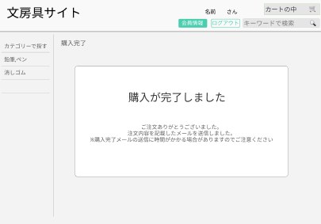

### 画面詳細図
## トップページ
### プロトタイプは以下のリンク先
[プロトタイプ](https://www.figma.com/file/ZBReba9UB4XT2DDuA352MB/文房具サイト?node-id=0%3A1)
*****

*****
捕捉：対応DBの列はDB設計後、○を対応するテーブル・カラム名に差し替えること。
| ID | 要素 | 内容 | アクション | イベント | 対応DB |
|----|------|-----|----------|---------|-------|
|1   |バナー|サイト名表示|-     |-        |-      |
|2   |名前|テキスト表示|-|-|-|
|3   |カートの中|ボタン|クリック|カートに遷移|-|
|4   |会員登録|ボタン|クリック|会員登録へ遷移|-|
|5   |ログアウト|ボタン|クリック   |トップページへ遷移|-      |
|6   |キーワード検索|入力欄|テキスト入力|-|-|
|7   |検索ボタン|ボタン|クリック|検索処理実行|〇|
|8   |カテゴリ|テキスト表示|-       |-       ||
|9   |購入が完了しました|テキスト表示|-|-|-|
|10  |購入完了の文|テキスト表示|-|-|-|

